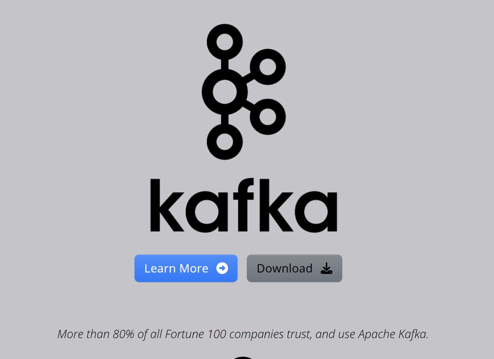

# 🚀 Spring Boot + Apache Kafka — Producer & Consumer

Proyecto de integración de **Spring Boot con Apache Kafka**, implementando una arquitectura basada en eventos mediante un **Producer** y un **Consumer**.

El objetivo del proyecto es demostrar cómo una aplicación Spring Boot puede publicar eventos en un tópico de Kafka y cómo otra aplicación puede consumirlos de forma desacoplada.

---

## 📌 Arquitectura

```text
                     ┌──────────────────────┐
                     │   Spring Provider    │
                     │                      │
                     │  KafkaProducerConfig │
                     │  KafkaTopicConfig    │
                     └──────────┬───────────┘
                                │
                                │ Publish Event
                                ▼
                     ┌──────────────────────┐
                     │     Apache Kafka     │
                     │                      │
                     │       Topic          │
                     └──────────┬───────────┘d
                                │
                                │ Consume Event
                                ▼
                     ┌──────────────────────┐
                     │   Spring Consumer    │
                     │                      │
                     │  KafkaConsumerConfig │
                     │  KafkaConsumerListener│
                     └──────────────────────┘
```

La comunicación entre ambas aplicaciones se realiza mediante **Apache Kafka**, evitando un acoplamiento directo entre Producer y Consumer.

---

# 🏗️ Estructura del proyecto

```text
Backend-SpringBoot-Kafka/
│
├── Spring-Provider/
│   │
│   ├── src/
│   │   ├── main/
│   │   │   ├── java/
│   │   │   │   └── com/backend/spring/provider/
│   │   │   │       │
│   │   │   │       ├── SpringProviderApplication.java
│   │   │   │       │
│   │   │   │       └── config/
│   │   │   │           ├── KafkaProviderConfig.java
│   │   │   │           └── KafkaTopicConfig.java
│   │   │   │
│   │   │   └── resources/
│   │   │       ├── application.properties
│   │   │       └── banner.txt
│   │   │
│   │   └── test/
│   │
│   ├── pom.xml
│   └── mvnw
│
├── Spring-Consumer/
│   │
│   ├── src/
│   │   ├── main/
│   │   │   ├── java/
│   │   │   │   └── com/backend/spring/provider/
│   │   │   │       │
│   │   │   │       ├── Spring_Consumer/
│   │   │   │       │   ├── SpringConsumerApplication.java
│   │   │   │       │   │
│   │   │   │       │   ├── config/
│   │   │   │       │   │   └── KafkaConsumerConfig.java
│   │   │   │       │   │
│   │   │   │       │   └── listener/
│   │   │   │       │       └── KafkaConsumerListener.java
│   │   │   │       │
│   │   │   │       └── ...
│   │   │   │
│   │   │   └── resources/
│   │   │       └── application.properties
│   │   │
│   │   └── test/
│   │
│   ├── pom.xml
│   └── mvnw
│
├── pom.xml
├── mvnw
├── mvnw.cmd
└── HELP.md
```

---

# 🔵 Spring Provider

El módulo `Spring-Provider` representa el **Producer** de Kafka.

Su responsabilidad es publicar mensajes/eventos en un tópico de Apache Kafka.

### Componentes principales

```text
SpringProviderApplication.java
```

Clase principal que inicia la aplicación Spring Boot.

```text
KafkaProviderConfig.java
```

Contiene la configuración relacionada con el productor Kafka.

```text
KafkaTopicConfig.java
```

Contiene la configuración relacionada con la creación/configuración del tópico Kafka.

---

# 🟢 Spring Consumer

El módulo `Spring-Consumer` representa el **Consumer**.

Su responsabilidad es escuchar los mensajes publicados en Kafka y procesarlos cuando llegan al tópico correspondiente.

### Componentes principales

```text
SpringConsumerApplication.java
```

Clase principal de la aplicación Consumer.

```text
KafkaConsumerConfig.java
```

Contiene la configuración necesaria para conectarse a Kafka como consumidor.

```text
KafkaConsumerListener.java
```

Listener encargado de recibir los mensajes publicados en el tópico.

Conceptualmente:

```text
Kafka Topic
     │
     │ Event
     ▼
KafkaConsumerListener
     │
     ▼
Message Processing
```

---

# 🔄 Flujo de comunicación

El flujo principal del proyecto es:

```text
1. Spring Provider
       │
       │
       ▼
2. Kafka Producer
       │
       │ publish()
       ▼
3. Apache Kafka
       │
       │ Topic
       ▼
4. Kafka Consumer
       │
       │ @KafkaListener
       ▼
5. KafkaConsumerListener
       │
       ▼
6. Procesamiento del mensaje
```

Esto permite implementar una arquitectura **event-driven** donde los componentes pueden comunicarse de forma asíncrona.

---

# 🧩 Tecnologías utilizadas

* ☕ Java
* 🌱 Spring Boot
* 📨 Apache Kafka
* 🔄 Spring Kafka
* 📦 Maven
* 🧪 JUnit
* 🐳 Docker *(opcional para ejecutar Kafka)*

---

# 📋 Requisitos

Antes de ejecutar el proyecto se recomienda tener instalado:

### Java

Verificar:

```bash
java -version
```

### Maven

El proyecto incluye Maven Wrapper, por lo que no es necesario instalar Maven globalmente.

En Linux/macOS:

```bash
./mvnw -version
```

En Windows:

```cmd
mvnw.cmd -version
```

### Apache Kafka

Es necesario tener un broker Kafka disponible.

También se puede ejecutar Kafka mediante Docker.

---

# 🐳 Ejecutar Kafka con Docker

Una forma sencilla de levantar Kafka es utilizando Docker Compose.

Ejemplo:

```yaml
services:

  kafka:
    image: apache/kafka:latest
    container_name: kafka
    ports:
      - "9092:9092"
    environment:
      KAFKA_NODE_ID: 1
      KAFKA_PROCESS_ROLES: broker,controller
      KAFKA_LISTENERS: PLAINTEXT://:9092,CONTROLLER://:9093
      KAFKA_ADVERTISED_LISTENERS: PLAINTEXT://localhost:9092
      KAFKA_CONTROLLER_LISTENER_NAMES: CONTROLLER
      KAFKA_CONTROLLER_QUORUM_VOTERS: 1@kafka:9093
      KAFKA_OFFSETS_TOPIC_REPLICATION_FACTOR: 1
```

Levantar Kafka:

```bash
docker compose up -d
```

Verificar el contenedor:

```bash
docker ps
```

---

# ▶️ Ejecutar Spring Provider

Ingresar al directorio:

```bash
cd Spring-Provider
```

Linux/macOS:

```bash
./mvnw spring-boot:run
```

Windows:

```cmd
mvnw.cmd spring-boot:run
```

También se puede ejecutar desde IntelliJ IDEA ejecutando:

```text
SpringProviderApplication
```

---

# ▶️ Ejecutar Spring Consumer

Abrir otra terminal:

```bash
cd Spring-Consumer
```

Linux/macOS:

```bash
./mvnw spring-boot:run
```

Windows:

```cmd
mvnw.cmd spring-boot:run
```

También se puede ejecutar desde IntelliJ IDEA ejecutando:

```text
SpringConsumerApplication
```

---

# 📡 Kafka Topic

El proyecto utiliza un tópico Kafka para transportar los eventos entre Producer y Consumer.

Conceptualmente:

```text
Producer
   │
   │
   ▼
┌─────────────────┐
│   Kafka Topic   │
└────────┬────────┘
         │
         ▼
     Consumer
```

El tópico actúa como un canal de comunicación desacoplado.

---

# 🔥 Producer vs Consumer

## Producer

El Producer es responsable de:

* Conectarse al broker Kafka.
* Crear/publicar mensajes.
* Enviar eventos a un tópico.
* Utilizar la configuración definida en `KafkaProviderConfig`.

```text
Application
     │
     ▼
Producer
     │
     ▼
Kafka Topic
```

## Consumer

El Consumer es responsable de:

* Conectarse al broker Kafka.
* Suscribirse al tópico.
* Recibir mensajes.
* Procesar los eventos mediante el listener.

```text
Kafka Topic
     │
     ▼
Consumer
     │
     ▼
Listener
```

---

# ⚡ Comunicación asíncrona

Una de las principales ventajas de utilizar Kafka es que Producer y Consumer no necesitan comunicarse directamente.

Sin Kafka:

```text
Producer ───────────────► Consumer
```

Con Kafka:

```text
Producer
    │
    ▼
 Kafka
    │
    ▼
Consumer
```

Esto permite reducir el acoplamiento entre los servicios y facilita la construcción de sistemas distribuidos.

---

# 🧠 Conceptos de Apache Kafka utilizados

Este proyecto permite trabajar con conceptos fundamentales de Kafka:

### Producer

Aplicación que publica mensajes.

### Consumer

Aplicación que consume mensajes.

### Topic

Canal lógico donde se almacenan los eventos.

### Broker

Servidor Kafka encargado de almacenar y distribuir los mensajes.

### Consumer Group

Grupo lógico de consumidores que permite distribuir el procesamiento de mensajes.

### Offset

Posición de un consumidor dentro de una partición.

Conceptualmente:

```text
Topic
│
├── Partition 0
│    ├── Offset 0
│    ├── Offset 1
│    ├── Offset 2
│    └── Offset 3
│
└── Partition 1
     ├── Offset 0
     ├── Offset 1
     └── Offset 2
```

---

# 🧪 Testing

Los módulos incluyen estructura para pruebas con JUnit.

Ejecutar las pruebas del Provider:

```bash
cd Spring-Provider
./mvnw test
```

Consumer:

```bash
cd Spring-Consumer
./mvnw test
```

En Windows:

```cmd
mvnw.cmd test
```

---

# 📦 Construir los proyectos

Provider:

```bash
cd Spring-Provider
./mvnw clean package
```

Consumer:

```bash
cd Spring-Consumer
./mvnw clean package
```

Los archivos `.jar` serán generados dentro de:

```text
target/
```

---

# 🏛️ Arquitectura Event-Driven

Este proyecto representa una arquitectura basada en eventos:

```text
                 EVENT-DRIVEN ARCHITECTURE

┌──────────────────┐
│ Spring Provider  │
└────────┬─────────┘
         │
         │ Event
         ▼
┌──────────────────┐
│  Apache Kafka    │
│                  │
│      Topic       │
└────────┬─────────┘
         │
         │ Event
         ▼
┌──────────────────┐
│ Spring Consumer  │
└──────────────────┘
```

Este patrón puede utilizarse como base para arquitecturas de:

* Microservicios
* E-commerce
* Procesamiento de órdenes
* Notificaciones
* Auditoría
* Integración entre sistemas
* Procesamiento de eventos
* Sistemas distribuidos

---

# 🔐 Configuración

La configuración de conexión a Kafka se encuentra en los archivos:

```text
Spring-Provider/src/main/resources/application.properties
```

y

```text
Spring-Consumer/src/main/resources/application.properties
```

Ejemplo conceptual:

```properties
spring.kafka.bootstrap-servers=localhost:9092
```

La configuración específica puede variar dependiendo del entorno donde se ejecute Kafka.

---

# 🌎 Arquitectura desacoplada

Una ventaja importante de este proyecto es el desacoplamiento:

```text
┌──────────────┐
│   Provider   │
└──────┬───────┘
       │
       │
       ▼
┌──────────────┐
│    Kafka     │
└──────┬───────┘
       │
       │
       ▼
┌──────────────┐
│   Consumer   │
└──────────────┘
```

El Provider no necesita conocer directamente la implementación interna del Consumer.

De igual manera, el Consumer puede evolucionar independientemente del Provider mientras mantenga el contrato de los eventos intercambiados.

---

# 🚀 Posibles mejoras

Este proyecto puede evolucionar incorporando:

* [ ] Kafka Producer con `KafkaTemplate`
* [ ] Múltiples particiones
* [ ] Consumer Groups
* [ ] Serialización JSON
* [ ] Apache Avro
* [ ] Schema Registry
* [ ] Kafka Streams
* [ ] Retry mechanisms
* [ ] Dead Letter Topics
* [ ] Error Handling
* [ ] Idempotencia
* [ ] Exactly-Once Semantics
* [ ] Observabilidad
* [ ] Micrometer
* [ ] Prometheus
* [ ] Grafana
* [ ] Docker Compose
* [ ] Kubernetes
* [ ] Spring Cloud Stream

---

# 💡 Objetivo del proyecto

El objetivo principal es comprender la integración entre **Spring Boot y Apache Kafka**, implementando comunicación asíncrona basada en eventos mediante un Producer y un Consumer independientes.

Este proyecto sirve como base para desarrollar posteriormente arquitecturas de **microservicios orientadas a eventos (Event-Driven Microservices)**.

---

# 👨‍💻 Author

**Casseli Layza**

Electronic Engineer | Telecom | Contact Center | Backend Developer | Java | Spring Boot | Apache Kafka

---

# ⭐ Skills demostradas

```text
Java
Spring Boot
Apache Kafka
Spring Kafka
Maven
Event-Driven Architecture
Asynchronous Communication
Producer / Consumer
Microservices
Distributed Systems
```

---

## 📚 Learning Path

```text
Spring Boot
     │
     ▼
Spring Kafka
     │
     ▼
Kafka Producer
     │
     ▼
Kafka Topic
     │
     ▼
Kafka Consumer
     │
     ▼
Event-Driven Architecture
     │
     ▼
Microservices
     │
     ▼
Distributed Systems
```

---

## 📄 License

Este proyecto es de carácter educativo y puede utilizarse como referencia para el aprendizaje de Spring Boot, Apache Kafka y arquitecturas orientadas a eventos.

## 📬 Contacto

Para dudas, sugerencias o contribuciones:

📧 [**casseli.layza@gmail.com**](mailto:casseli.layza@gmail.com)

🔗 [LinkedIn](https://www.linkedin.com/in/casseli-layza/) 🔗 [GitHub](https://github.com/CasseliLayza)

💡 **Desarrollado por Casseli Layza como parte de un proyecto con SpringCloud / SpringBoot. Arquitectura Event Driven.**

**_💚 ¡Gracias por revisar este proyecto!... Powered by Casse 🌟📚🚀...!!_**

## Derechos Reservados

```markdown
© 2026 Casse. Todos los derechos reservados.
```